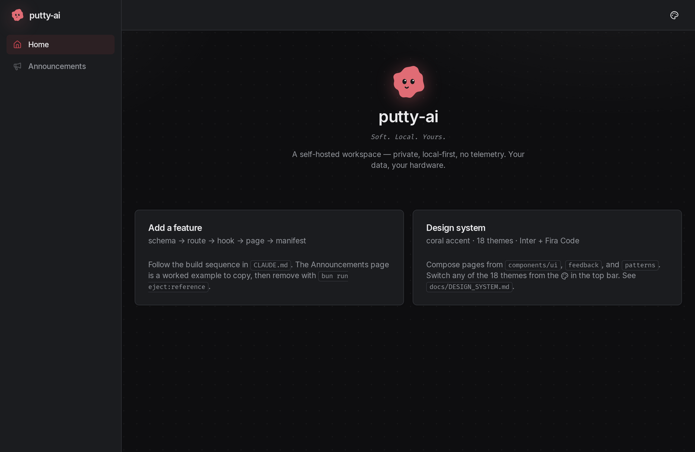
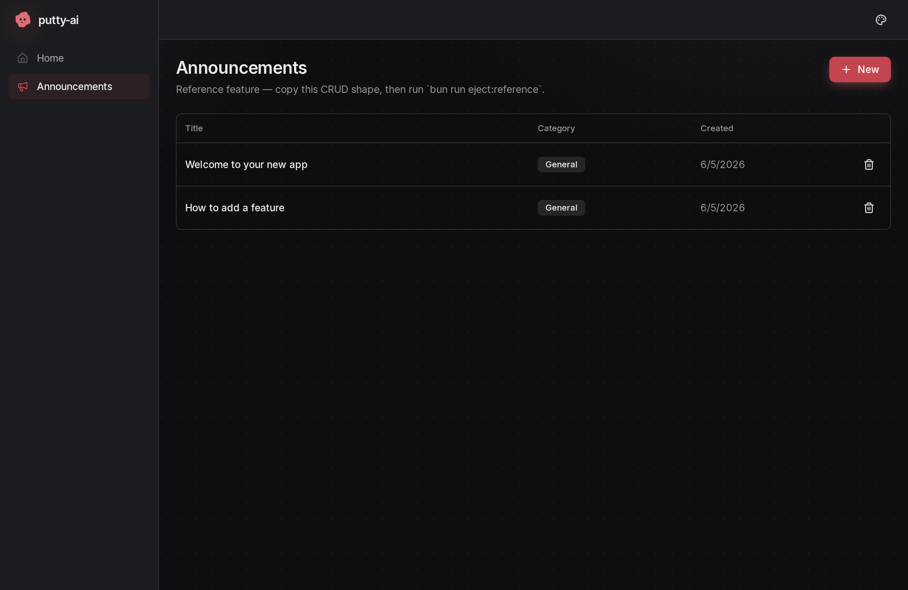
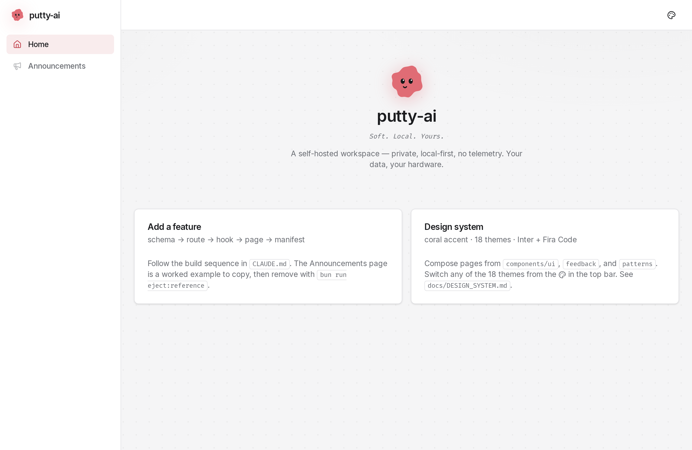

# Full-Stack Template

**A wiring-only full-stack template you build *into*, not *from scratch*.** The
architecture is decided, the primitives are built, and a complete reference
feature shows the golden path. Clone it, write a one-page brief, and ship
features into an already-wired skeleton — with an AI agent or by hand.

> **One Bun process** serves the Elysia API **and** the React SPA — same-origin,
> no CORS, no nginx. Type-safe end to end with **zero codegen**. SQLite-backed.
> One Docker image, one `docker compose up`.

`Bun` · `Elysia` · `React 19` · `SQLite + Drizzle` · `Tailwind v4` · `Docker`

---

## Look & feel

Skinned with the **putty-ai** design system — an ink canvas, Inter + Fira Code,
borders over shadows, and **coral as the interactive accent** (buttons, links,
focus, active nav). Ships **18 runtime-switchable themes** (putty mono + light,
Ocean, Midnight, Claude, Terminal, Cute…) selectable from the top-bar palette;
the whole shadcn/Radix primitive library re-skins from `data-theme` CSS tokens —
no component changes.

| Home (dark) | Reference CRUD page (dark) |
|---|---|
|  |  |

| Home (Putty Light) |
|---|
|  |

---

## Why this exists

Most "starters" hand you a pile of dependencies and a blank `App.tsx`. You still
spend the first week deciding how errors, auth, validation, data fetching,
routing, and deploys fit together — and re-litigating it on every feature.

This template makes those decisions **once** and **enforces them with the
compiler**, so every feature is the same boring, copy-the-reference shape:

- **End-to-end types, no codegen.** The frontend imports the API's *type*; the
  whole request/response surface is inferred. Change a route, the caller stops
  compiling.
- **One response shape, enforced.** Every handler returns `ok(data)` or throws a
  typed `AppError`; a bare object won't type-check.
- **One place for each thing.** Routes register in one barrel, pages in one
  manifest — nav and router can't drift.

### Is it for you?

| Great fit | Look elsewhere |
|-----------|----------------|
| Self-hosted apps, internal tools, side projects | Multi-tenant SaaS out of the box |
| Single user or a small trusted team | Large teams needing RBAC / SSO on day one |
| You want type safety + low ops | You want a kitchen-sink framework |

It's deliberately **narrow**: SQLite, single-process, shared-bearer auth. Those
are features for the target, and documented escape hatches (Postgres, a separate
service, real multi-user) for when you outgrow them. See `docs/ARCHITECTURE.md`.

## The end-to-end type safety, concretely

```ts
// API — packages/api/src/routes/announcements.ts
export default new Elysia({ prefix: '/api/announcements' })
  .get('/', ({ query }) => ok(rows, pageMeta(...)), { query: paginationQuery })

// packages/api/src/app.ts
export type App = typeof app                  // the whole API surface, no codegen
```

```ts
// Frontend — packages/frontend/src/hooks/use-announcements.ts
const data = await unwrap<Announcement[]>(
  api.announcements.get({ query: { limit: 50 } }),  // path, query, body all typed
)  // ▲ rename the route or change its params, and THIS line stops compiling
```

## Quickstart

```bash
scripts/init-project.sh "My App"   # writes .env (token + name), installs, migrates, seeds

bun run dev                        # API :4000 + Vite :3000 (HMR)
# …or the containerized stack, mirroring production:
docker compose up -d --build       # http://localhost:3000
```

Open the app, click into **Announcements** — that's the reference feature, a full
vertical slice (table → API → hook → page → nav). Read it, copy its shape, then
`bun run eject:reference` once your own features replace it.

## How you build a feature

1. **Brief** — fill in `PROJECT_BRIEF.md` (one page: what it does, entities,
   pages, what's out of scope). Hand it to Claude: *"Build this per CLAUDE.md."*
2. **Spec** (anything non-trivial) — `cp specs/SPEC_TEMPLATE.md specs/<resource>.md`
   and pin the exact data model, API contract, and acceptance criteria. A spec is
   an agent-followable plan whose **Acceptance** list maps 1:1 onto its tests —
   so "did the agent follow it?" becomes `bun run check`. See `specs/README.md`.
3. **Build** — the six-step sequence (schema → route → hook → page → nav →
   tests), each step mirroring the reference. Full detail in `CLAUDE.md`.
4. **Gate** — `bun run check` (type-check + lint + test) must be green.

## What's already wired

**Backend** — response envelope + typed errors · fail-fast env validation · auth
gate (shared bearer) · pagination helpers · reusable validators · Pino logging ·
correlation IDs · SQLite (WAL) with migrations-on-boot + idempotent seed ·
security headers · health/whoami endpoints · optional Swagger.

**Frontend** — type-safe API client (`api.*` + `unwrap`) · TanStack Query setup ·
manifest-driven router + sidebar · UI primitives (Radix + CVA) · CRUD patterns
(`DataTable` / `FormDialog` / `ConfirmDialog`) · loading/empty/error states ·
18-theme switcher · error boundary.

**Ops** — single multi-stage Docker image · `docker compose` · backup/restore
scripts · pre-commit hooks · spec drift-guard test.

Full index: `WIRED.md`.

## Everyday commands

```bash
bun run check            # type-check + lint + test — the gate
bun run dev              # local dev with HMR
bun run db:generate      # after editing packages/api/src/db/schema.ts
bun run db:migrate       # apply migrations (also runs on API boot)
bun run db:seed          # idempotent seed
bun run eject:reference  # remove the example feature when you're ready
./scripts/backup.sh      # gzipped SQLite snapshot (cron-friendly)
```

## Project map

| Path | What |
|------|------|
| `packages/api` | Bun + Elysia API (serves the SPA in production too) |
| `packages/frontend` | React SPA |
| `CLAUDE.md` | **Start here to build** — build sequence + enforced conventions |
| `PROJECT_BRIEF.md` | The one-page brief you fill in for a new app |
| `specs/` | Feature-spec workflow (template, worked example, the method) |
| `docs/ARCHITECTURE.md` | Topology, decisions, deploy, escape hatches |
| `docs/DESIGN_SYSTEM.md` | UI primitives + page archetypes |
| `WIRED.md` | One-page index of every wired capability |
| `GOTCHAS.md` | The sharp edges (skim on clone) |

## Auth

Ships **Mode B** — a shared bearer token in `.env`, baked into the SPA bundle.
It stops opportunistic scanning, not credential theft (the bundle is only served
where the token already reaches). `docs/ARCHITECTURE.md` covers **Mode A** (none,
LAN-only) and **Mode C** (login + signed cookie, ~60 lines).

## Deploying & exposing

`docker compose up -d --build` runs everything on `:3000`. Data lives in a Docker
volume; logs go to stdout. To reach it from other devices, put Tailscale / Caddy
/ Cloudflare Tunnel in front — and **run the pre-expose checklist** in
`docs/ARCHITECTURE.md` (auth tested, secrets out of git, Swagger off, backup
restored) before exposing it anywhere.
